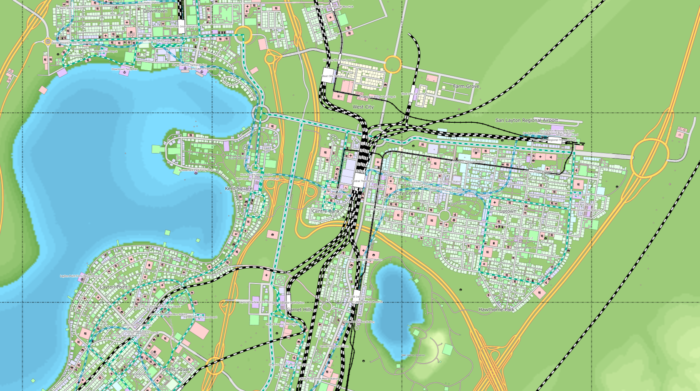

## City Planning

Suppose you are designing a city from the ground up. You would have to do quite a lot of planning before you could even begin construction. Maybe you the think the roads should be built first. But wait, what about utilities like water and sewer? Often those go under the roads for the sake of easy maintenance, so it would make sense to build those first. But you know the roads are going to go over them, so you need to route them where the soil conditions are acceptable for both the pipes and the paving over top, as well as take into account the grades of any inclines along the path. But wait, since you're building a city from scratch, you don't actually know if/how many people will live along this road. Those factors would determine the size of the road and the gauge of the pipes. There's a lot to think about, and we've barely even begun!

Perhaps a better way to go about designing this city would be to follow some set of guidelines based on the knowledge and experiences of city planners who came before you. Certainly, your city would not be identical to theirs; after all, you have the chance to design something new and innovative, and besides, you have your own unique landscape to work with. But any good design pattern is not just a cookie cutter copy-and-paste of something else. Rather, it describes a set of protocols and standard procedures that can serve as a starting point and a basic framework. This idea is not just limited to city planning, though. It can be applied to any sort of complicated and interdepedent project, like those found in software engineering. Over the years, many effective design patterns have been created and built upon by generations of developers. Most recently, I myself have made use of this body of pre-existing work in my project to build a website for the various clubs at UH Manoa.

## The Model-View-Controller Design Pattern

The MVC, or Model-View-Controller design pattern, is a way of breaking down the functionality of an application into three different areas of responsibility. The model section holds the actual data that the application uses. The view handles the way that data is displayed to the user. And the controller handles the interactions between the other two, both delivering data from the model to the view as well as controlling the flow of new data into the model. Separating these three aspects allows us to break a project into smaller parts, for the sake of clarity as well as sanity. As an example, my current project involves storing information about clubs and presenting parts of that information to the proper users. In this case, the model is the database that holds all the details of a club: its name, description, and owner, as well as a list of users who are members. The view is composed of the UI elements that display information to the users. The controller handles who gets to interact with what information based on what roles a user has been assigned in the form of Meteor publications. For example, the founder of a club can change their club's information and see all of that club's members, but a normal user can only see public information like the name, description, and club owner. Meanwhile, an administrator has edit permissions and can see the member's list of any club. By following a clear design pattern like the MVC, we can streamline the development of our application and set ourselves up for success.
