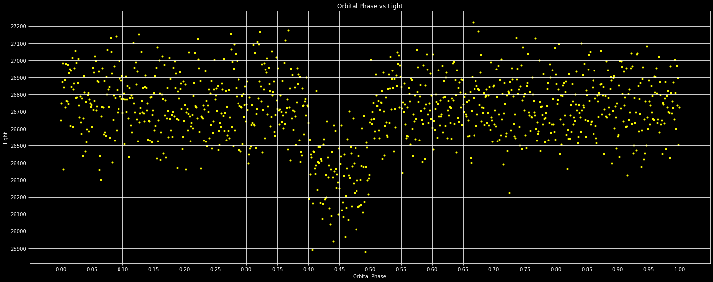

Exoplanets are most commonly discovered using the transit technique, in which we observe the drop in the light from a star as the planet passes in front of the disk of the star. Astronomers use many different telescopes to detect exoplanets with this technique. The star is observed for days, weeks, or months. If a transit is found, it is possible to plot the flux of the star as a function of the orbital phase and the time since some reference point in the orbit as a fraction of the orbital period. The radius of the planet can be calculated as a fraction of the radius of the star by measuring the fractional decrease in the flux of the star during transit relative to outside of transit. The amount of light lost during the transit as a fraction of flux of the star is the ratio of the cross-sectional area of the planet to the cross-sectional area of the star.

This was the first important project that I completed for my degree, and while there was some collaboration with classmates, all the coding work was my own. As my first real Python project, this was an important learning experience since Python is the unofficial standard language for astronomy. I gained valuable experience in creating and formatting figures using pyplot in matplotlib.

Python .py file [here.](https://github.com/nathan-getchel/coderepo/blob/main/ASTR%20300%20Project%201.py)
