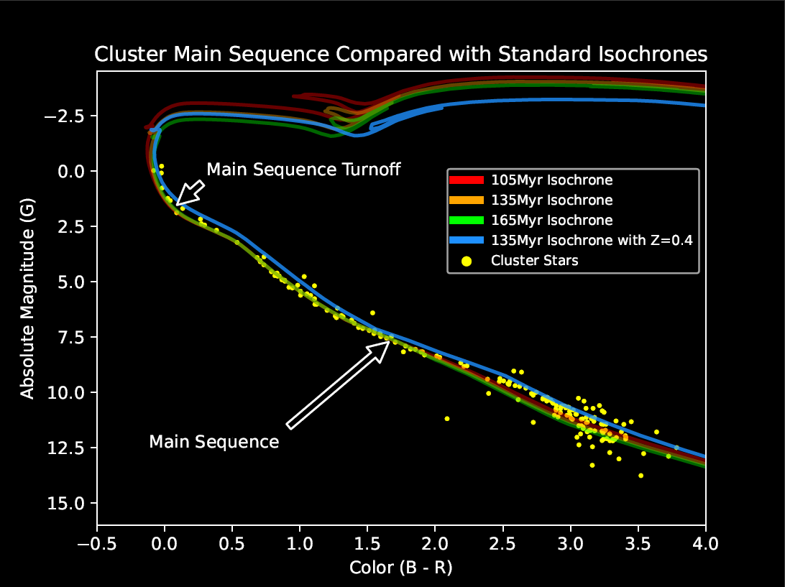

Star clusters are dense groups of stars that have formed at roughly the same time from the same material. This knowledge allows us to make some basic assumptions in order to determine other properties about them such as their age and distance from us. The first step, however, is obtaining the raw data and filtering out stars that do not belong to the cluster. For this project, I used the astroquery module to pull data from the Gaia space telescope on all the stars in a small area around the Pleiades star cluster. This gave me all the stars in the cluster, but it also gave me all the stars in front, behind, and around the cluster. In order to do anything useful with these data, the "field stars" must be filtered out until only the cluster's stars remain. To do this, I plotted all the stars' positional characteristics on a histogram and looked for spikes in the data. Stars in the cluster will be tightly grouped and move together, whereas field stars will be roughly evenly distributed and have random motions. After visually locating these spikes, I manually set the limits by which to filter and then removed all the stars not part of the cluster from the data. Now, with the contaminant stars gone, I could plot the stars by their color values and brightness and construct what is called a color-magnitude diagram. This type of diagram shows the “main sequence” of the cluster, which is a line representing the lifecycle of most common stars. As stars age, they tend to move through this line and eventually leave the main sequence near the ends of their normal lives. Armed with this knowledge, and with models of what the main sequence looks like for normal stars at different ages, we can compare the cluster’s main sequence against different models to determine the age of the cluster. When I made this comparison and checked my results (since the age of the Pleiades is already known), I found I had a near perfect answer of approximately 135 million years, and an average distance of about 135 parsecs.

This project was quite a headache for me at times. The initial data set required some effort just to get, as I had no prior experience with astroquery. Once I properly accessed it, it contained tens of thousands of objects. For a comparison, my final color-magnitude diagram contained only 180 objects. That’s a lot to filter out! Also, an important consideration I had to make was how strictly to filter these objects. Not strict enough, and I would have a mess of unrelated objects. Too strict, and I wouldn’t have enough stars left to draw accurate conclusions. I think I reached a happy medium and ended up with a data set representative of the whole cluster, even though some members were surely filtered out along with the field stars. This was by far the most time-intensive coding project that I have completed to date, and all the work was done solely by me.

Link to Jupyter Notebook [here.](https://github.com/nathan-getchel/coderepo/blob/main/pleiades_github.ipynb)
