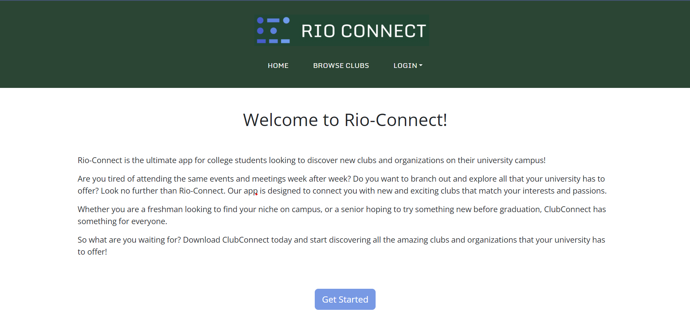
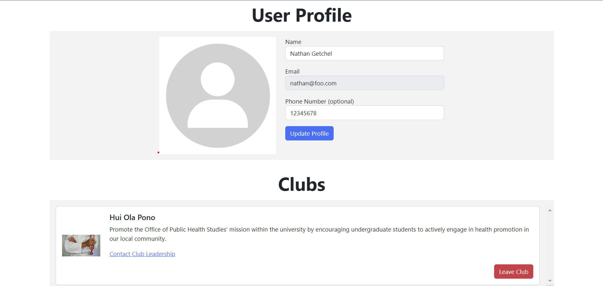
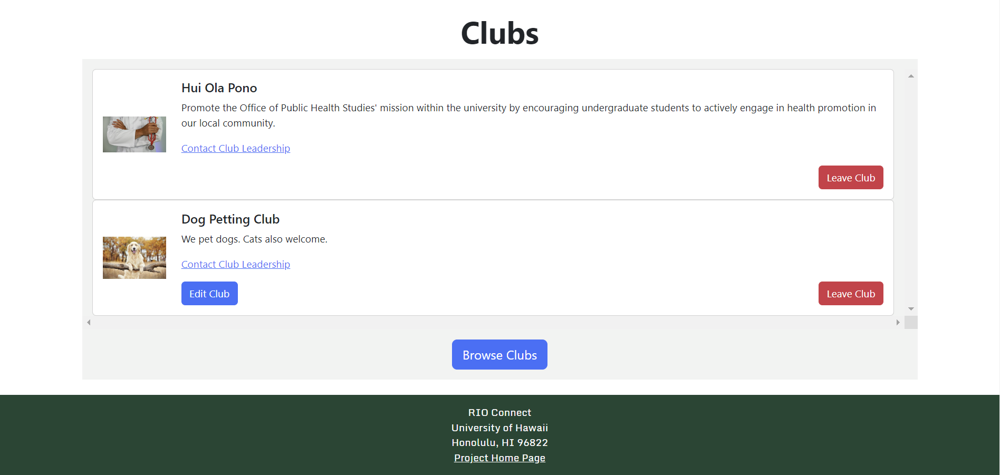
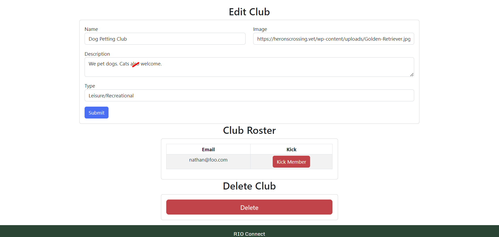

For the final project of ICS 314, we were tasked with creating a web application with a small team of our classmates. This application had several requirements it had to meet, namely a minimum of four separate pages, and the ability to read and write data to/from a database. Our site also allowed users to log in and have personal profiles.

## A Brief Walkthrough

  
  

The images above show a couple of the pages of our site. The first image shows the landing page, which is the root of the site. Whenever you navigate to rio-connect.com, you will end up here. The second image is my user page. Here, I can change my profile info, as well as see what clubs I've joined. For now, I have only joined Hui Ola Pono, the public health club. I can also click a link which will open my default email client and send a message to the club president.

  
  

In this first image you can see the clubs section of my profile again, but now I have created my own club. It is displayed much the same as the other club I joined, except it has an edit button since I am the owner of this club. In the second image, you can see the page I am taken to if I click the edit button. I can change the club's info or delete it entirely, as well as see a list of the members and kick any people out of the club if I so choose. Since I just created this fake club to demonstrate functionality, I am the only member, and I cannot kick myself because I am the owner.

## Other Notes

I won't go into too much detail about the entire site for this relatively brief description. In addition to the pages previously mentioned, the site also has a page for adding new clubs, and a page for browsing clubs that can be filtered by club type, or searchable by club name. The site also has an admin account which cannot join any clubs, but has access to edit every club to ensure that all of the site's users are behaving appropriately.

## Final Reflections

Throughout ICS 314 we completed a lot of assignments using JavaScript, CSS, Bootstrap, React, MongoDB for database management, and Meteor. This final project was a chance to put it all together, as well as to experience how software engineering works as part of a team. I found working as a team to be very helpful, since everyone had their own strengths to bring to the table. For example, one team member had experience with graphic design, and did a great job designing our logo and making the site's theme/colors look nice. Another member became our go-to for deployment. As for myself, I found UI design to be quite difficult, but I had some experience working with large datasets because of my Astrophysics major. In science, and particularly in astronomy, we work with huge amounts of information. Therefore, I mostly worked on the back-end, handling the overarching data structure and Meteor publications. In the few instances where I did create my own components, I largely just copied the design from other components that my team members had designed. This ensured that the design stayed consistent and looked nice. Overall, I think working as a team creates a lot of versatility and results in a better end product than working alone. If you'd like to see what we accomplished together, take a look at our [website](https://rio-connect.com) and our [documentation](https://rio-connect.github.io/).

