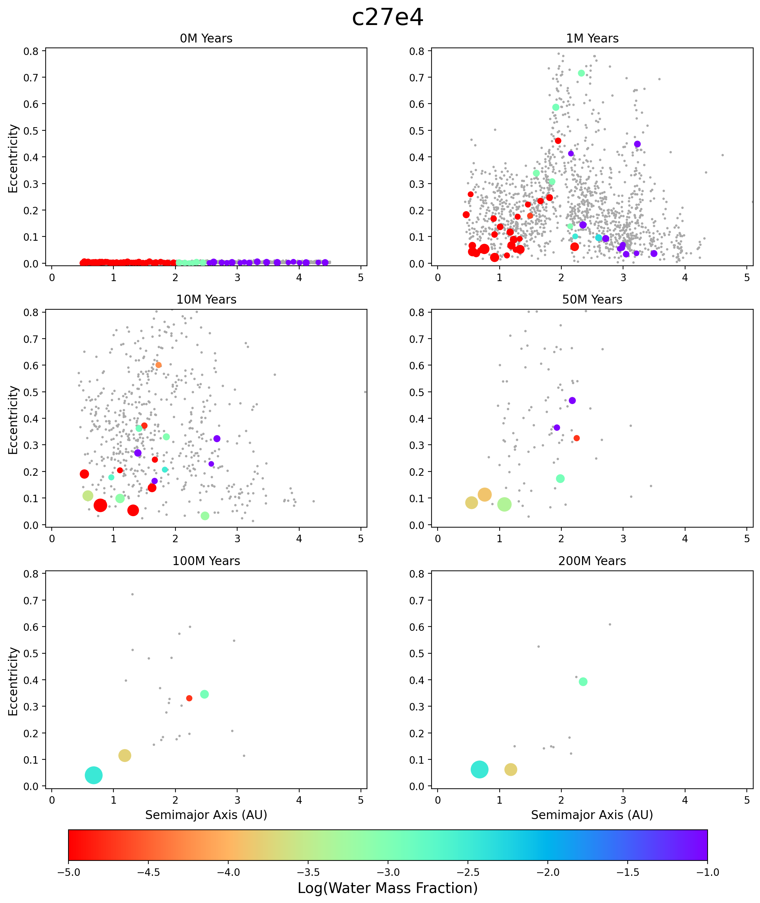
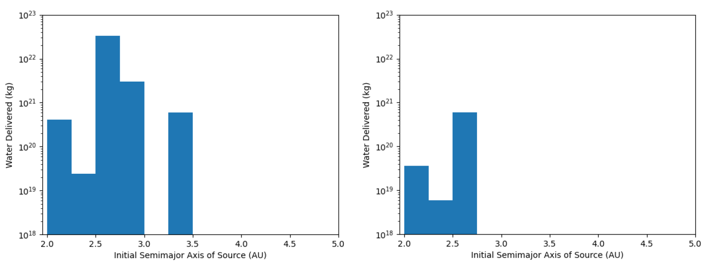

## Abstract

The search for life outside Earth has a long history. Although Mars has attracted more attention, Venus is more similar to Earth with respect to its size, mass, and orbital distance, and is considered a prime candidate for past potential to support life. However, Venus’ surface is incredibly hot, with an atmosphere of mostly carbon dioxide reaching surface pressures of 92 bar. These extreme differences between the planets raise the question of why they are similar in some respects, yet so different in others. What events have occurred in the two planets’ histories that caused Venus to become so harsh while Earth is so hospitable? The natural starting point to answer this is the formation process. By simulating the growth of terrestrial planets, we will be able to identify the processes that resulted in the formation of Earth and Venus, and the amount and source of the planets’ water. We have carried out several hundred simulations of the formation of the inner solar system from different distributions and compositions of the protoplanetary disk. Results indicate two important findings. First, in almost all simulations, an Earth-analog is formed and Venus forms as a bonus-product. Second, the number of Venus-analogs increases when the protoplanetary disk considers local density variations. Our analysis will address the above questions and yield insights into the processes of habitable planet formation, as well as what indicators of life to look for in exoplanets. We present details of our study and discuss the implications of its results.

## Introduction

Though Mars has captured the public consciousness in the search for life outside Earth, the planet most similar to our own is actually Venus. Venus shares many physical attributes with Earth, having approximately 82% of Earth's mass and 95% of its equatorial radius, while orbiting the Sun at about 72% of Earth's distance. Because of these similarities, Venus has often been referred to as ``Earth’s twin.'' Despite these commonalities, the environments of the two planets are very different. Venus' surface is extremely hot, with temperatures reaching over 460°C, and its thick atmosphere, mostly composed of carbon dioxide, creates surface pressures over 90 bars and features clouds of sulfuric acid (Williams 2016), (Davis & Carney 2023). These extreme conditions raise an important question: How did two planets that began with such similar properties evolve to such different states?

Understanding the processes that shaped Venus and Earth’s divergent paths may shed light on the broader question of planetary formation and evolution across the universe. The study of Venus, in particular, offers a unique opportunity to explore why Earth became a hospitable environment for life while Venus turned into a hostile, greenhouse effect-dominated world. Some chemical anomalies in Venus' atmosphere have even led to speculations about potential biological processes at work (Cleland & Rimmer 2022). This has spurred further scientific interest, with Venus becoming a focal point for research into planetary atmospheres and the conditions necessary for life. NASA is currently planning two new missions to Venus, VERITAS and DAVINCI. Expected to launch in the early 2030s, VERITAS will study the surface of the planet by taking “high-resolution topographic and radar images,” and DAVINCI will study the composition of the atmosphere  (Davis & Carney 2023).

One key area of investigation is the difference in the chemical compositions of Earth and Venus, particularly with respect to their atmospheres. Venus has higher concentrations of noble gases such as neon, argon, krypton, and xenon than Earth, along with a nearly total lack of water (Owen et al. 1992), (Williams 2016). These compositional differences increase the complexity of the problem by raising questions about the details of the formation of Venus and the types of materials that were introduced to its accretion zone. While models of early solar system evolution have been able to account for the water content and general composition of Earth  (Izidoro et al. 2014), the processes that shaped Venus' current state remain an open question.

To better understand the underlying reasons for the differences between the planets, we turn to computer simulations. Using a variety of initial conditions, we have performed comprehensive simulations in order to model the late stage of terrestrial planet formation in our solar system and study the formation of Venus, especially in connection to the formation of Earth. These models accounted for the effects of gravitational perturbations from Jupiter and Saturn, as well as variations in the mass and distribution of planetesimals and planetary embryos in the protoplanetary disk. Here, we present a detailed analysis of the results to demonstrate that Venus likely retained a significant amount of water in its early stages of development, the sources of which were mostly water-rich objects originating in the range of the present-day asteroid belt.

Our simulations began with a distribution of small objects resembling the early protoplanetary disk, and tracked their mass, chemical composition (particularly water content), and orbital dynamics as they coalesced to form larger bodies. If the system reached a stable configuration resembling the modern solar system with identifiable Earth- and Venus-analogs, we examined the details of the simulated impacts and transport of water to determine how these processes shaped the distinct atmospheres and surfaces of Earth and Venus. The analysis of these results provides insights into the processes that lead to Earth-like and Venus-like planets, offering a deeper understanding of planetary evolution both within our solar system and beyond.

## Methodology

We considered a system consisting of the Sun, Jupiter, Saturn, and a protoplanetary disk extending from 0.5 AU to 4.5 AU. The disk consisted of a few hundred Moon- to Mars-sized planetary embryos and 1000-1200 small planetesimals. This setup was designed to model the final stage of terrestrial planet formation, which was the main focus of our investigation. This configuration also ensures that the planetary embryos will have low eccentricities and low inclinations due to interactions with the planetesimals. We followed the standard procedure as outlined in (Haghighipour & Winter 2016) and distributed the embryos such that the surface density of the disk would follow an r-1.5 profile. We assumed the bodies interior to 2 AU would be dry, those between 2 AU and 2.5 AU would be composed of 1% water by mass, and those beyond 2.5 AU would be composed of 10% water by mass. These assumptions match the water content observed in meteorites in our solar system.

We conducted 200 simulations, each with different distributions of embryos, and integrated each system using the N-body integration package Mercury (Chambers 1999. Mercury is a hybrid symplectic integrator specifically designed for modeling planetary systems. We ran each simulation for 200 Myrs. This gives enough time for the initial system of many small bodies to settle into a stable configuration of planets. We assumed all collisions were perfectly inelastic, which means the impactor would be fully absorbed by the impactee. This results in the growth of the latter through perfect-merging. This assumption is unrealistic, but it is the industry standard since it enables us to identify the compositions of the final planets by tracing back through their collisions. We then identified all simulations that resulted in the formation of analogs to Venus and Earth. We considered a simulated planet with a mass of 1-3 Venus-masses orbiting at 0.6-0.7 AU as a Venus-analog, and a simulated planet with a mass of 0.5-2.5 Earth-masses orbiting at a distance of 0.9-1.2 AU as an Earth-analog. Once these were identified, we determined their water contents and the region in the protoplanetary disk from which their water originated.

## Results

We carried out 200 simulations, each with a different set up for the protoplanetary disk. From these simulations, 36 (18%) ended up as planetary systems with planets in orbits similar to Venus and Earth, and six produced a Venus-analog (3%). Interestingly, out of 200 simulations, only one produced a coupled system with a Venus-analog and an Earth-analog (0.5%), indicating that such coupled systems are very rare. We note that in our solar system, Venus’ orbit is strongly coupled to Earth. In all cases, the masses of the Venus-analogs were within one order of magnitude of the mass of Venus, and their water-masses alone weigh more than the entirety of the actual Venusian atmosphere, with masses ranging from roughly 4 to 80 times more. The analysis of the data indicates that the weighted average of the initial semimajor axes of the analog planets’ constituent objects populate a range from 2.5 – 3 AU. The figure below shows histograms of these water-source objects for the coupled Venus- and Earth-analogs (same simulated solar system as figure above). As shown here, a sharp cutoff appears at or before 3.5 AU, which means that all of the water present on the analog planets was originally from the inner solar system. Using these simulations as guides, we would expect that the real Venus would have experienced a similar history, initially having much more water that has since evaporated and been absorbed by the atmosphere. The latter led to an extreme greenhouse effect, causing the temperature and pressure of the planet to skyrocket, and thus explaining the differences seen today between Venus and Earth.

## References

Chambers, J. E. 1999, MNRAS, 304, 793, doi: 10.1046/j.1365-8711.1999.02379.x
Cleland, C. E., & Rimmer, P. B. 2022, Aerospace, 9, 752, doi: 10.3390/aerospace9120752
Davis, P., & Carney, S. 2023, Overview | Venus, NASA Solar System Exploration https://solarsystem.nasa.gov/planets/venus/overview/
Haghighipour, N., & Winter, O. C. 2016, Celestial Mechanics and Dynamical Astronomy, 124, 235, doi: 10.1007/s10569-015-9663-y
Izidoro, A., Haghighipour, N., Winter, O. C., & Tsuchida, M. 2014, ApJ, 782, 31, doi: 10.1088/0004-637X/782/1/31
Owen, T., Bar-Nun, A., & Kleinfeld, I. 1992, Nature, 358, 43, doi: 10.1038/358043a0
Williams, D. R. 2016, Venus Fact Sheet, NASA Space Science Data Coordinated Archive https://nssdc.gsfc.nasa.gov/planetary/factsheet/venusfact.html